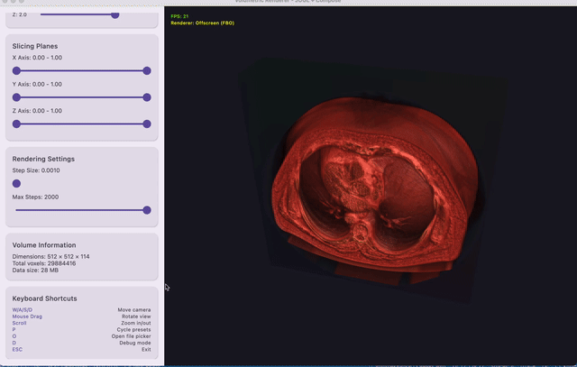
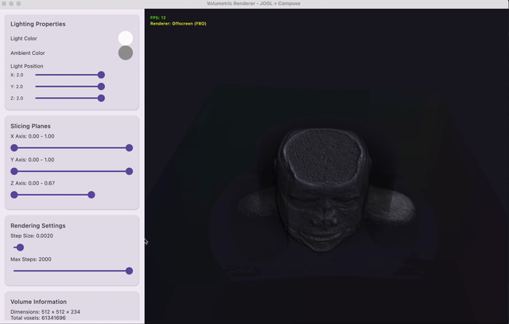

# Kotlin Volumetric Renderer

A high-performance, GPU-accelerated 3D volumetric rendering application built with **Kotlin Multiplatform** and **Compose Desktop**. This project is a modern migration of a legacy C++/OpenGL ray caster, designed for medical imaging visualization (CT/MRI).

### Demos
<p align="center">
  
  
</p> 

## 🚀 Features

### 🖥️ Rendering Engine
- **GPU Ray Casting:** High-quality volumetric rendering using GLSL 4.1 shaders with adaptive step size calculation.
- **Advanced Shading:** Blinn-Phong model with Half-Lambert diffusion for realistic lighting and soft shadows without "soot" artifacts.
- **Dynamic Quality:** Fluid interaction system that instantly switches between responsive performance mode and high-fidelity sampling when stationary.
- **Opacity Correction:** Mathematically correct opacity accumulation independent of sampling rate.
- **Offscreen Rendering:** Stable, flicker-free rendering using FBOs integrated into Compose Desktop.

### 🎨 Visualization Tools
- **Transfer Function Editor:** Professional-grade editor with:
  - Gradient stops with color interpolation.
  - Opacity curve editing.
  - Real-time histogram overlay.
- **Material Controls:** Real-time adjustment of lighting (position, color) and material properties (shininess, ambient/diffuse/specular).
- **Presets:** Built-in presets for common scenarios (CT Anatomy, Cardiac MRI, Bone, Soft Tissue).

### 📂 Data Support
- **DICOM Support:** Loads single DICOM files and full series directories using `dcm4che`.
- **NIfTI Support:** Native support for `.nii` and `.nii.gz` files.
- **16-bit Precision:** Full support for high-dynamic-range medical data with automatic Big/Little Endian handling and range normalization.

## 🛠️ Technology Stack

- **Language:** Kotlin 1.9.22 (Multiplatform)
- **UI Framework:** Compose Desktop 1.5.11
- **Graphics API:** OpenGL 4.1 Core Profile (via JOGL 2.5.0)
- **Build System:** Gradle 8.5
- **DICOM Library:** dcm4che 5.31.0

## 📦 Project Structure

```
kotlin-volumetric-renderer/
├── core/           # Shared logic (Math, Data Models, Shaders)
├── desktop/        # Desktop Application (Compose UI + JOGL Renderer)
├── renderer/       # Platform-specific Rendering Backends
└── data/           # Sample datasets
```

## 🏃‍♂️ Getting Started

### Prerequisites
- JDK 17 or higher
- OpenGL 4.1 compatible graphics card

### Running the Application

1. **Clone the repository:**
   ```bash
   git clone <repository-url>
   cd kotlin-volumetric-renderer
   ```

2. **Run with a sample file:**
   ```bash
   ./gradlew desktop:run --args="path/to/your/file.nii.gz"
   ```

   Or load a DICOM directory:
   ```bash
   ./gradlew desktop:run --args="path/to/dicom/series/"
   ```

### Controls

| Input | Action |
|-------|--------|
| **Mouse Drag** | Rotate Camera (Arcball) |
| **Scroll** | Zoom In/Out |
| **W / A / S / D** | Move Camera |
| **Q / Space** | Move Up/Down |
| **P** | Cycle Transfer Function Presets |
| **G** | Toggle Debug Modes (Normal -> Density -> Coords) |

## 📄 License

MIT License
